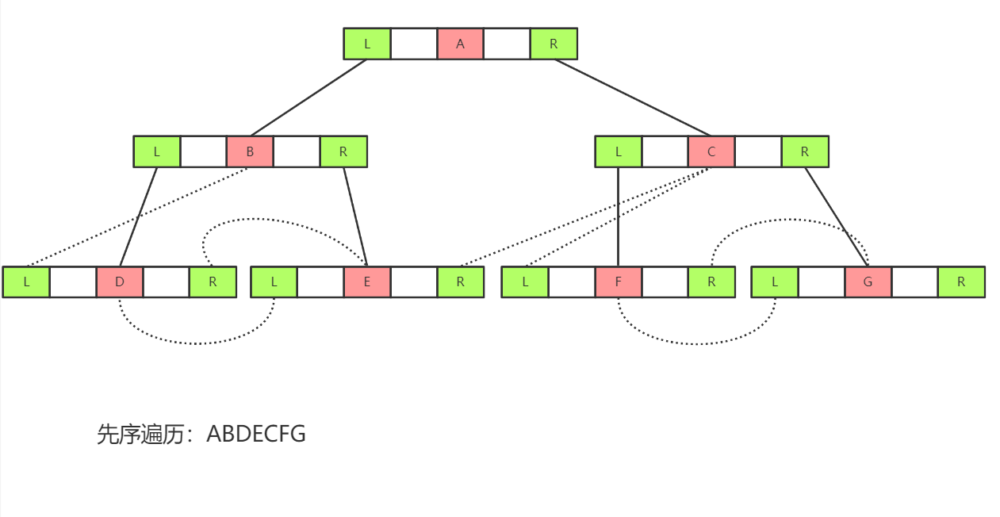
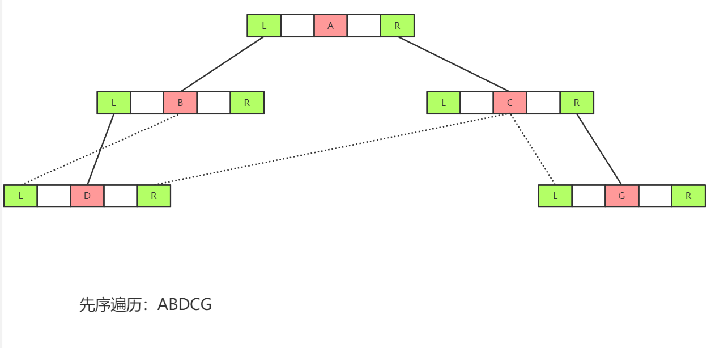

# 树

### 赫夫曼树

#### 定义

​	给定 N 个带有权值的叶子节点，构造一棵二叉树，若该树的带权路径长度达到最小，称这样的二叉树为最优二叉树，也成为哈夫曼树。哈夫曼树是带权路径长度最短的树，权值较大的节点离根较近。	

### 二叉树线索树

#### 定义

​	对于n个结点的二叉树，在二叉链存储结构中有n+1个空链域，利用这些空链域存放在某种遍历次序下该结点的前驱结点和后继结点的指针，这些指针称为线索，加上线索的二叉树称为线索二叉树。

#### 优势

​	任意一个结点都能直接找到它的前驱和后继结点。

#### 先序构造

​	

- 根节点左指针指向 左兄弟、父节点
- 根节点右指针指向 右兄弟、父节点右兄弟、NULL

​	

​				

### 平衡二叉树

#### 定义

​	它是一个空树或者左右两树的高度差不大于一，且左右子数也是平衡二叉树