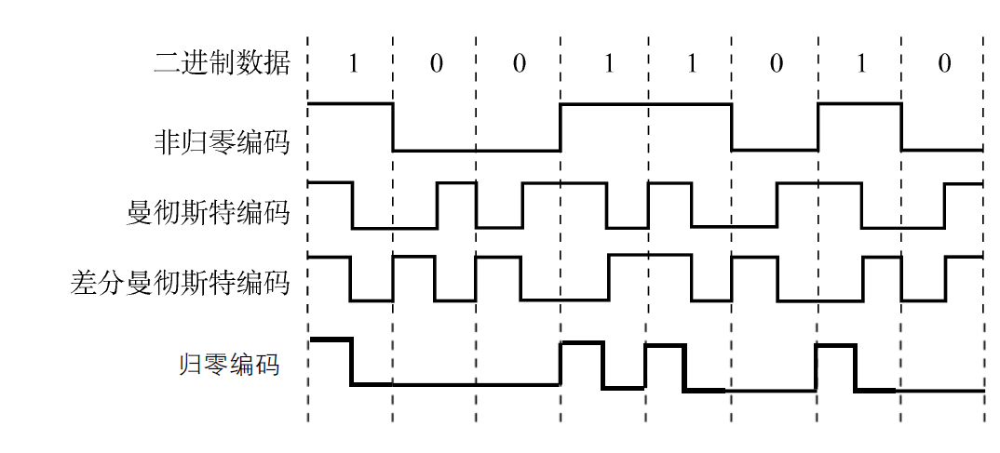
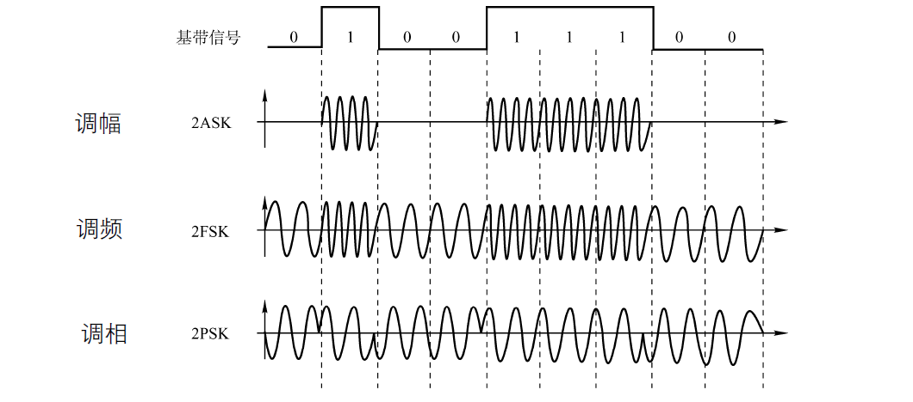
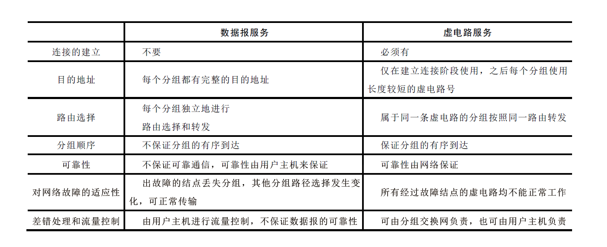

# 绪论

## 性能指标

### 速率

- 又称--------数据传输率、比特率
- 单位---------------位  /  秒

### 带宽

- 网络最大支持速率
- 单位------------ 位 / 秒

### 吞吐量

- 单位时间通过的比特数量
- 单位------------- 位 / 秒

### 时延

- 数据从一端到另一端所需要的时间
- 发送时延 + 传播时延 + 排队时延 + 处理时延
- 发送时延--------------- 数据长度 / 信道带宽
- 传播时延---------------- 信道长度 / 电磁波传播速率

### 时延带宽积

- 以比特为单位的链路长度
- 时延 × 带宽

### 往返时间RTT

- 从发送到接到返回信息需要的时间
- 传播时延 × 2

### 利用率

- 信道利用率--------------有数据通过时间 / 总时间
- 网络利用率--------------- 加权的信道利用率

# 物理层

## 数据通信

### 码元

- 单位---------------- Baud
- 固定时长的信号波形
- 可以携带多个比特信息
- 默认为二进制

### 速率

- 单位时间通过的比特数量
- 单位------------ 位 / 秒

### 波特

- 单位时间通过的码元数量
- 又称 码元传输速率

### 奈氏准则

- 内部影响

- 受传播频率影响，单位时间内传输的码元有最大限制

- 单位----------- Baud / s

- $$
    2×W×long_2V
    $$

- W 为传输频率，单位--------Hz

- V 为码元代表的比特数

### 信噪比

- 单位 dB

- $$
    S/N
    $$

- $$
    10long_{10}(S/N)
    $$

- 公式上下数值等价

### 香农定理

- 外部影响

- 受噪声影响，单位时间内传输的比特数有最大限制

- $$
    W  long_2(1+S/N)
    $$

### 香农 && 奈氏

- 以最小的为准
- 只要低于信道的极限传输速率，一定有某种方法实现无差别传输

## 编码 && 调制

### 非归零编码

- 高电压表示1
- 低电压表示0
- 一个周期内不发生变化

### 归零编码

- 高电压表示1
- 低电压表示0
- 在周期结束时回归低电压

### 曼彻斯特编码

- 高电压表示1
- 低电压表示0
- 一个周期内有高低两个电压
- 前半周期的电压决定编码

### 差分慢车斯顿编码

- 决定编码的是周期结束时电压的变化
- 一个周期有高低两个电压
- 周期结束时电压变化表示 0
- 周期结束时电压未变化表示 1

### 4B / 5B 编码

- 打破二进制数据一串 0 或  一串 1 的状态
- 编码利用率为  4 / 5 = 80%

### 

### 调制

## 数据交换方式

### 为什么

- 节省通信线路
- 降低费用

### 电路交换

- 独占资源
- 适合远程批处理信息传输 、实时性大量数据传输
- 建立连接（ 建立电路 ） =======>  通信 （ 数据传输 ）===========> 释放连接（ 拆除电路 ）
- 优点  ：传输时延小、无失序问题、实时性强、全双工、控制简单
- 缺点  ：连接创建长、信道利用低、无法应对突发情况、难以平滑通信、无法纠错

### 报文交换

- 报文  ：  一次性发送的数据块，数据大小不定
- 采用储存转发方式
- 无需建立专门的链路
- 优点  ：  无需连接、动态分配、多目标发送
- 缺点  ：  仅适合数字信号、实时性差、传送时延增大

### 分组交换

- 采用储存转发方式
- 将报文分成限定大小发送
- 128B
- 优点  ：  适合突发式通信
- 缺点  ：  处理分组需要时间

### 电路  && 报文 && 分组

- 连接时间  <  传输时间  ，需要传输大量数据时，选择 电路交换 
- 平时选择 分组交换，适合突发式的数据通信

### 数据报方式

- 节点收到分组，进行 差错检测、路由选择
- 差错检测  ：  无差错   ---->  向上一节点发送确定信息  ------->   上一节点丢弃分组副本
- 提供无连接服务
- 不同分组可能会发生乱序问题
- 对故障的适应能力强，适合突发通信
- 网络发生拥塞时，部分分组可能被丢弃

### 虚电路方式

- 逻辑上的电路交换，两端和节点构成的逻辑通路
- 建立连接  ------>   数据传输 ---------->  释放连接
- 分组不会乱序、重复、丢失
- 每个分组不需要携带目标地址，仅带较短的虚电路号
- 若一个节点损坏，该虚电路将遭到破坏

### 数据报 && 虚电路

- 

### 